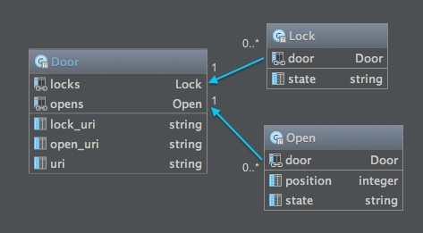

# Interface client du rideau de fer
> Interface Web pour la gestion et le contrôle d'applications du Web de Objets de type rideau de fer

## Motivations
Le but de cette application est de fournir une interface graphique pour gérer et contrôler différents rideaux de fer. Le fait de créer une interface Web permet de la rendre accessible facilement au plus grand nombre de personnes possibles. En effet le HTML, CSS et Javascript aussi bien que l’usage de techniques tels que le responsive design permettent cela.

## Description
Cette application a pour but de fournir une interface graphique afin de contrôler un rideau de fer. Cette application est facile d’utilisation et disponible sur tout type de terminal possédant un navigateur Web. Le principe est que l’application effectue des requêtes vers le serveur d’un rideau de fer et affiche le résultat des requêtes mise en forme avec le HTML dans le navigateur.

L’application a pour but de gérer différents rideaux de fer depuis le même endroit. Ainsi, en plus du contrôle du rideau de fer, il est possible d’enregistrer, lister et supprimer les différents rideaux de fer à gérer. De même que tous les états successifs de chaque rideau de fer sont sauvegardés dans une base de données SQLite.

### Description de l’interface
L’interface, se compose de trois parties distinctes.

1. Enregistrer une nouvelle porte, lister toutes les portes déjà enregistrées et supprimer ou modifier une porte enregistrée.
2. Interagir avec la porte sélectionnée. A savoir ouvrir/fermer la porte et verrouiller/déverrouiller la porte.
3. lister tous les états passés de la porte sélectionnée.

L’implémentation des notifications n’a pas été directement réalisée dans l’interface. Le serveur Rails reçoit les notifications du serveur de l’Arduino, les enregistre, mais ne les affiche pas en temps réel. Cependant, cela serait très facile de le faire grâce à un Web socket ou à du Polling, par exemple grâce à la gem [websocket-rails](https://github.com/websocket-rails/websocket-rails). Il n’y a pas non plus de gestion des utilisateurs ni des droits. Tout le monde peut tout faire. Nous n’avons pas implémenté ces deux fonctionnalités, parce qu’elles ont été réalisées à de nombreuses reprises et que nous avons préféré nous concentrer sur d’autres aspects plus intéressants.

### Description de l’implémentation

Pour cette partie, nous n’allons pas discuter de l’implémentation en détail, nous partons du principe qu’avec une bonne connaissance du framework Rails, le code est compréhensible. Nous allons uniquement nous concentrer sur la fonctionnalité d’enregistrement/sélection du rideau de fer que nous avons implémenté.

Tout d’abord, rappelons qu’une des conventions de Rails veut que toute la « Buisness Logic » se trouve dans les modèles. De plus, nous voulons que les informations transmises par le serveur du rideau de fer soient enregistrées, dans une base de donnée SQLite dans notre application client. Nous avons donc défini trois modèles en utilisant ActiveRecord, c’est-à-dire, les modèles `Door`, `Lock` et `Open`. L’image ci-dessous montre les champs de chaque modèle et leurs relations.



Retenons uniquement qu’un modèle Door peut être relié entre zéro et un nombre infini de fois au modèle Lock et Open. Ainsi, tous les états d’un rideau de fer sont sauvegardés, de même que quand notre application client reçoit une notification du rideau de fer, l’état du composant d’ouverture/fermeture ou du composant de verrouillage/déverrouillage est sauvegardé.

Le code ci-dessous montre comment la méthode `fetch` du modèle `Open` a été implémentée.

```ruby
  def self.fetch(uri)
    params = get_params(uri)
    open = Open.new(params.remove(:uri).params)
    open.state = params.get(:state)
    open
  end
```


Pour interroger le serveur, nous avons défini une méthode fetch dans chacun des trois modèles. Cette méthode est responsable d’effectuer la requête vers le serveur, grâce à la librairie Ruby [RestClient](https://github.com/rest-client/rest-client), de parser le JSON obtenu et finalement de retourner une instance du modèle contenant les valeurs obtenues du serveur. Comme le code pour effectuer une requête vers le serveur et parser le JSON est toujours le même, nous avons défini la méthode `get_params` dans le module `ClassParams`, lui-même compris dans le module `Concerns::DoorMethods` étendu de `ActiveSupport::Concern`. Grâce aux spécificités de Ruby, chaque classe incluant ce module dispose de la méthode `get_params`. De même que pour simplifier l’interaction avec le `Hash` obtenu à partir du JSON, nous avons défini la classe `DoorParams`.

Pour le modèle `Door`, nous avons également implémenté notre propre validateur (`DoorValidator`) qui effectue deux validations spécifiques à notre cas. La première vérifie que l’URL de la
porte fournie n’est pas vide, tandis que la deuxième vérifie que le serveur a retourné une réponse correcte. Procéder ainsi, permet d’afficher des messages d’erreurs adaptés dans
le formulaire d’enregistrement de la porte.

A chaque fois qu’une porte est enregistrée, l’état du rideau de fer correspondant est récupéré depuis le serveur et l’inscription aux notifications du rideau de fer est également créée. De même qu’à chaque sélection d’une porte, l’inscription aux notifications est mise à jour. Ainsi, dès qu’une porte est enregistrée les notifications la concernant seront réceptionnées par l’interface client et stockées dans la base de données. À la sélection d’une porte, tous les états, et donc aussi les notifications, qui sont également des états du rideau de fer, sont consultables. Tandis que si une porte est supprimée de l’interface client, ainsi que tous ses états, une requête sera envoyée vers le rideau de fer afin d’annuler l’envoi de notifications.

Afin d’obtenir un visuel agréable à peu de frais, nous avons utilisé le framework HTML /CSS/Javascript [Foundation](http://foundation.zurb.com). Ce framework, un peu moins connu que bootstrap, permet d’obtenir des interfaces visuelles propres en assemblant des composants proposés par le framework. Nous avons effectué ce choix pour quatre raisons:


1. Framework bien maîtrisé ne demandant pas de temps d’apprentissage.
2. Grand choix de composants et très bien documenté.
3. Adaptatif à différentes tailles d’écrans (du smartphone à l’écran de télévision).
4. Très facilement modifiable grâce au langage Sass

Pour obtenir la liste de tous les URIs, la commande `rake routes` peut être exécutées dans le répertoire de base de cette application.

## Utilisation

Pour utiliser l'application, lancer la commande `rails server` depuis le répertoire de l'application. Si l'application est lancée pour la première fois, exécuter tout d'abord la commande `rake db:migrate`.

Par défaut l'application est lancée avec le serveur Webricks. En production il pourrait être plus judicieux d'utiliser un serveur plus robuste et plus sécurisé. Une possibilité pourrait être [thin](http://code.macournoyer.com/thin/) ou [passenger](https://www.phusionpassenger.com)

La base de données est en SQLite et nécessite pas de configuration supplémentaire.
